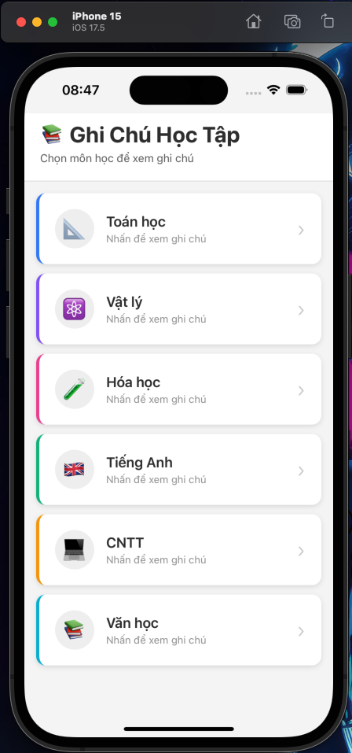
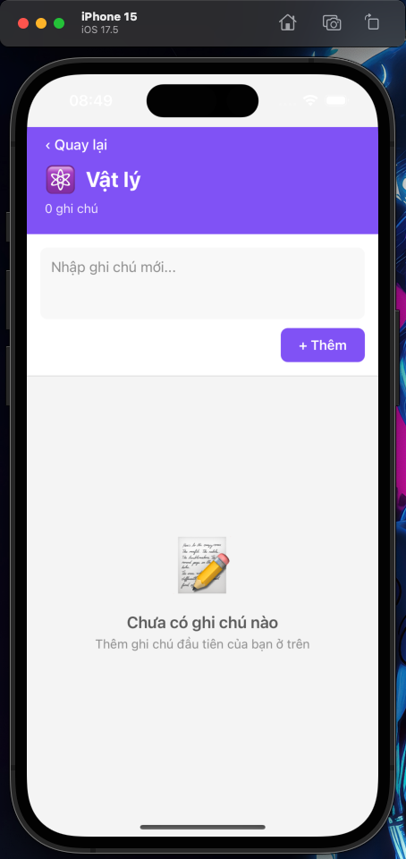
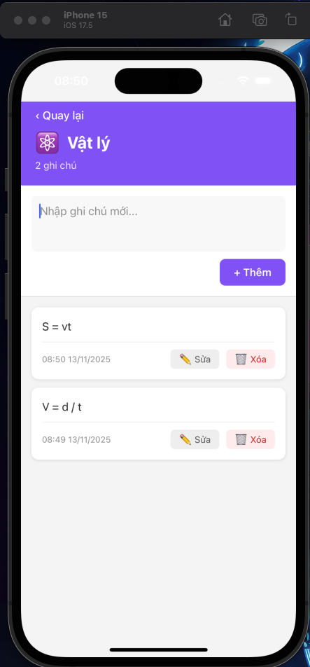
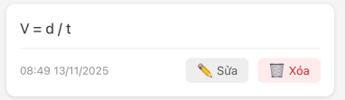

# 📚 Ứng dụng Ghi Chú Học Tập (Study Notes) midterm exam


Ứng dụng React Native với Expo Router và AsyncStorage để quản lý ghi chú học tập theo từng môn học.


## 🔗 Repository

```bash
https://github.com/PhanLuc1/midterm-exam
```

## 📸 Screenshots

### Màn hình chính
- Hiển thị danh sách 6 môn học với icon và màu sắc riêng biệt

- Hiển thị hint "Nhấn để xem ghi chú" có thể select item để ghi chú 

### Màn hình ghi chú
- Header với màu sắc theo môn học,Thêm/Sửa/Xóa ghi chú

- Hiển thị thời gian tạo và cập nhật

- Empty state khi chưa có ghi chú

## ✨ Tính năng

- ✅ **6 môn học mặc định**: Toán, Vật lý, Hóa học, Tiếng Anh, CNTT, Văn học
- ✅ **Quản lý ghi chú**: Thêm, sửa, xóa ghi chú cho từng môn
- ✅ **Lưu trữ local**: Dữ liệu được lưu persistent với AsyncStorage
- ✅ **Giao diện thân thiện**: Thiết kế hiện đại, dễ sử dụng
- ✅ **Keyboard handling**: Tự động điều chỉnh khi bàn phím xuất hiện
- ✅ **Xác nhận xóa**: Tránh xóa nhầm ghi chú quan trọng
- ✅ **Timestamp**: Hiển thị thời gian tạo và cập nhật ghi chú

## 🚀 Cài đặt và Chạy

### Yêu cầu hệ thống

- **Node.js**: >= 18.x
- **npm** hoặc **yarn**
- **Expo Go app** (trên điện thoại) hoặc **Android Emulator/iOS Simulator**

### Bước 1: Clone repository

```bash
git clone https://github.com/PhanLuc1/midterm-exam.git
cd midterm-exam
```

### Bước 2: Cài đặt dependencies

```bash
npm install
```

### Bước 3: Chạy ứng dụng

#### Chạy trên tất cả platforms

```bash
npm start
```

Sau đó chọn:
- Nhấn `a` - Mở Android Emulator
- Nhấn `i` - Mở iOS Simulator (chỉ trên Mac)
- Nhấn `w` - Mở trên Web browser
- **Quét QR code** - Chạy trên thiết bị thật (cần cài Expo Go)

#### Chạy trực tiếp trên Android

```bash
npm run android
```

#### Chạy trực tiếp trên iOS (Mac only)

```bash
npm run ios
```

#### Chạy trên Web

```bash
npm run web
```

### Bước 4: Cài đặt Expo Go (cho thiết bị thật)

- **Android**: [Tải từ Google Play Store](https://play.google.com/store/apps/details?id=host.exp.exponent)
- **iOS**: [Tải từ App Store](https://apps.apple.com/app/expo-go/id982107779)

Sau khi cài xong, quét QR code từ terminal để chạy ứng dụng.

## 📁 Cấu trúc thư mục

```
midterm-exam/
├── app/
│   ├── services/
│   │   └── storageService.ts    # Service quản lý AsyncStorage
│   ├── _layout.tsx               # Root layout với SafeAreaProvider
│   ├── index.tsx                 # Màn hình chính (danh sách môn học)
│   └── notes.tsx                 # Màn hình ghi chú chi tiết
├── assets/                       # Hình ảnh và tài nguyên
├── components/                   # Shared components
├── constants/                    # Hằng số và config
├── hooks/                        # Custom hooks
├── app.json                      # Cấu hình Expo
├── capacitor.config.json         # Cấu hình Capacitor (theo yêu cầu đề bài)
├── package.json                  # Dependencies
├── tsconfig.json                 # TypeScript config
└── README.md                     # File này
```

## 🛠️ Công nghệ sử dụng

| Công nghệ | Mục đích |
|-----------|----------|
| **React Native** | Framework phát triển mobile cross-platform |
| **Expo** | Toolchain và platform để build React Native apps |
| **Expo Router** | File-based routing cho navigation |
| **TypeScript** | Type safety và developer experience |
| **AsyncStorage** | Lưu trữ dữ liệu local persistent |
| **react-native-safe-area-context** | Xử lý safe area trên các thiết bị |

## 💾 Lưu trữ dữ liệu

Ứng dụng sử dụng **AsyncStorage** để lưu trữ dữ liệu local:

- **Key `subjects`**: Lưu danh sách môn học
- **Key `notes_{subjectId}`**: Lưu ghi chú của từng môn (ví dụ: `notes_1`, `notes_2`, ...)

Dữ liệu được lưu dưới dạng JSON và tồn tại vĩnh viễn trên thiết bị cho đến khi:
- Xóa cache ứng dụng
- Gỡ cài đặt ứng dụng

**Lưu ý**: File `capacitor.config.json` được thêm vào theo yêu cầu đề bài, nhưng ứng dụng thực tế sử dụng AsyncStorage thay vì Capacitor Storage do tính tương thích tốt hơn với Expo.

## 📱 Hướng dẫn sử dụng

### Màn hình chính
1. Mở ứng dụng sẽ thấy danh sách 6 môn học
2. Nhấn vào bất kỳ môn học nào để xem ghi chú

### Màn hình ghi chú
1. **Thêm ghi chú mới**: Nhập nội dung vào ô input → Nhấn nút "➕ Thêm"
2. **Sửa ghi chú**: Nhấn nút "✏️ Sửa" → Chỉnh sửa → Nhấn "✓ Cập nhật"
3. **Xóa ghi chú**: Nhấn nút "🗑️ Xóa" → Xác nhận xóa
4. **Quay lại**: Nhấn "‹ Quay lại" ở góc trên bên trái

## 🐛 Xử lý lỗi thường gặp

### Lỗi: "Cannot find module"

```bash
# Xóa node_modules và cài lại
rm -rf node_modules
npm install
```

### Lỗi: "Metro bundler stuck"

```bash
# Xóa cache và khởi động lại
npm start -- --clear
```

### Lỗi: "AsyncStorage is null"

```bash
# Cài lại AsyncStorage
npx expo install @react-native-async-storage/async-storage
```

### Lỗi khi build trên iOS

```bash
# Cài lại pods (chỉ trên Mac)
cd ios
pod install
cd ..
npm run ios
```

## 📦 Dependencies chính

```json
{
  "dependencies": {
    "expo": "~52.0.0",
    "expo-router": "~4.0.0",
    "react": "18.3.1",
    "react-native": "0.76.0",
    "@react-native-async-storage/async-storage": "^2.1.0",
    "react-native-safe-area-context": "^4.12.0"
  }
}
```

## 🧪 Kiểm thử

```bash
# Chạy tests (nếu có)
npm test

# Kiểm tra TypeScript
npx tsc --noEmit

# Kiểm tra ESLint
npm run lint
```

## 📝 Scripts có sẵn

```bash
npm start          # Khởi động Metro bundler
npm run android    # Chạy trên Android
npm run ios        # Chạy trên iOS
npm run web        # Chạy trên Web browser
npm test           # Chạy tests
npm run lint       # Kiểm tra code style
```

## 🤝 Đóng góp

Nếu bạn muốn đóng góp cho dự án:

1. Fork repository
2. Tạo branch mới (`git checkout -b feature/AmazingFeature`)
3. Commit changes (`git commit -m 'Add some AmazingFeature'`)
4. Push to branch (`git push origin feature/AmazingFeature`)
5. Mở Pull Request

## 📄 License

Dự án này được phát triển cho mục đích học tập.

## 👨‍💻 Tác giả

**Phan Luc**
- GitHub: [@PhanLuc1](https://github.com/PhanLuc1)
- Repository: [midterm-exam](https://github.com/PhanLuc1/midterm-exam)

## 📞 Liên hệ

Nếu có bất kỳ câu hỏi nào, vui lòng tạo issue trên GitHub hoặc liên hệ qua repository.

---

⭐ Nếu thấy project hữu ích, hãy cho một star nhé! ⭐